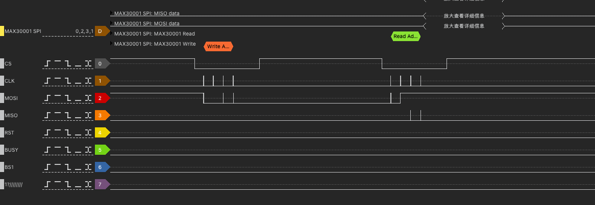
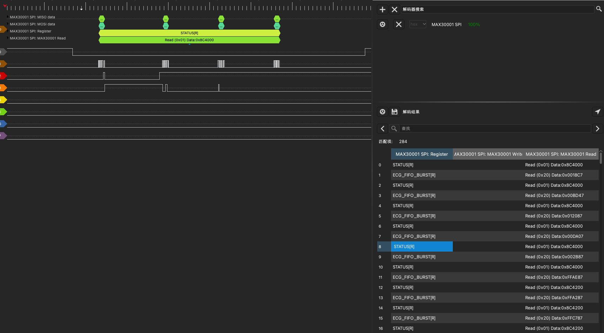

# MAX30001 SPI Decoder for DSView

## Overview
This project provides a DSView-based decoder for analyzing SPI communication with the MAX30001 ECG and bioimpedance AFE chip. The decoder extracts and interprets SPI data exchanged between a microcontroller and the MAX30001, allowing for easier debugging and signal analysis.

## Files
- **`max30001_dataset.pdf`** - Documentation related to the dataset.
- **`max30001_demo.dsl`** - Test file for verifying the decoder functionality.
- **`pd.py`** - Python script for handling protocol decoding.
- **`__init__.py`** - Initialization file for the decoder package.
- **`demo1.png`, `demo2.png`** - Sample images demonstrating the decoder in action.

## Installation
1. Install **DSView** if you haven’t already.
2. Copy the decoder files into the appropriate DSView protocol decoder directory.
3. Restart DSView to recognize the new decoder.

## Usage
1. Open DSView and select the MAX30001 SPI decoder.
2. Load the `max30001_demo.dsl` test file to verify functionality.
3. Capture SPI signals from your logic analyzer.
4. Use the decoder to analyze MAX30001 SPI communication.

## Demo
The following images show the decoder in action:

## License
This project is open-source. Feel free to modify and contribute!
